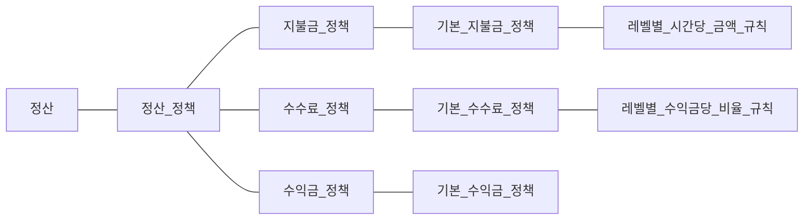
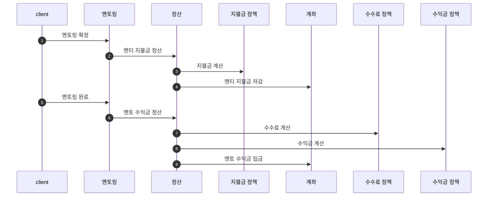

## 모델링
### 정산

### 멘토링
- [x] 멘토링은 다음 중 하나의 상태를 갖는다.
    - 요청, 수락, 확정, 완료
    - [x] 멘토링은 최초에 요청 상태를 갖는다.
    - [x] 멘토링을 수락한다.
    - [x] 멘토링을 확정한다.
    - [x] 멘토링을 완료한다.

### 정산
- [x] 기본 지불금 정책에 따라 멘티의 지불금을 정산한다.
- [x] 기본 수익금, 기본 수수료 정책에 따라 멘토의 수익금을 정산한다.

- 정산 과정

### 기본 지불금 정책
- [x] 멘토의 레벨별 시간당 금액 규칙으로 지불금을 계산한다.
  - 멘토링 시간 x 레벨별 시간당 금액

#### 레벨별 시간당 금액 규칙
- [x] 멘토의 레벨에 맞는 시간당 금액 찾아 반환한다.
  - [x] 비기너: 3,000 
  - [x] 아마추어: 5,000
  - [x] 세미프로: 10,000
  - [x] 프로: 30,000

### 기본 수익금 정책
- [x] 수익금을 계산한다.
    - 지불금 - 수수료

### 수수료 정책
#### 기본 정책
- [x] 수익금/레벨 별 수수료 비율 규칙으로 수수료를 계산한다.

### 수수료 비율 규칙
#### 레벨별 수익금당 비율 규칙
- [x] 수익금과 레벨에 맞는 수수료 비율을 찾아 반환한다.
    - 레벨이 비기너, 아마추어, 세미프로, 프로 순일 때 수익금별 비율은 다음과 같다.
        - [x] A type: 수익금이 '1만원 미만' 일 때 레벨에 따라 다음과 같은 비율을 반환한다.
            - 2.7%, 2.6%, 2.5%, 2.4%
        - [x] B type: 수익금이 '1만원 이상 5만원 미만' 일 때 레벨에 따라 다음과 같은 비율을 반환한다.
            - 2.8%, 2.7%, 2.6%, 2.5%
        - [x] C type: 수익금이 '5만원 이상 10만원 미만' 일 때 레벨에 따라 다음과 같은 비율을 반환한다.
            - 2.9%, 2.8%, 2.7%, 2.6%
        - [x] D type: 수익금이 '10만원 이상' 일 때 레벨에 따라 다음과 같은 비율을 반환한다.
            - 3%, 2.9%, 2.8%, 2.7%

### 계좌
- [x] 지불금을 차감한다.
- [x] 수익금을 입금한다.
